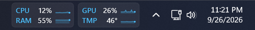
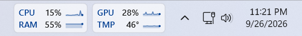
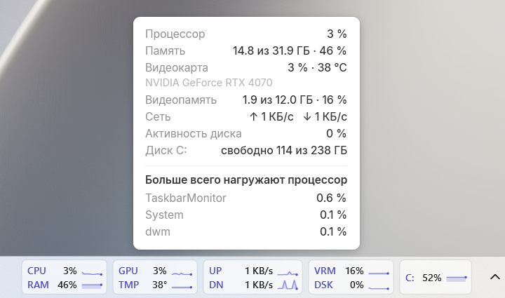
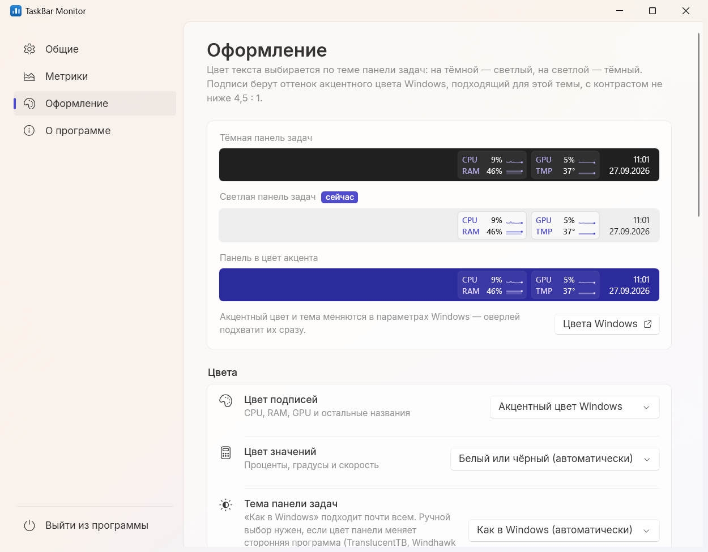

# TaskBar Monitor

Маленькая программа, которая показывает загрузку процессора, памяти и видеокарты прямо на панели задач Windows 11.

Главная фишка — цвет текста сам подстраивается под тему. На тёмной панели текст светлый, на светлой — тёмный, а подписи окрашены в акцентный цвет Windows. Поменяли тему или акцент в параметрах — оверлей перекрасится сразу, без перезапуска.




## Что умеет

- CPU, RAM, GPU, температура и память видеокарты, сеть, диски — что показывать и в каком порядке, решаете сами
- Жёлтый и красный цвет при высокой нагрузке, мини-графики за последнюю минуту
- Подробности при наведении: сколько памяти занято, какая видеокарта и какие процессы сильнее всего нагружают процессор
- Шрифт на выбор: Segoe UI, Inter, Montserrat, Roboto, Calibri, Verdana, Times New Roman, JetBrains Mono и другие
- Горячая клавиша, чтобы быстро спрятать или показать оверлей
- Прячется, когда открыта игра или видео на весь экран
- Сама проверяет, не вышла ли новая версия
- Запуск вместе с Windows
- Настройки в стиле Windows 11 — с такими же плавными переходами между разделами





## Как запустить

Нужен [.NET Desktop Runtime 10](https://dotnet.microsoft.com/download/dotnet/10.0).

```
dotnet publish -c Release -o dist
```

Запустите `dist\TaskbarMonitor.exe`. Чтобы открыть настройки, запустите программу ещё раз или щёлкните по оверлею правой кнопкой.

## Полезно знать

- Температуру процессора показать не получится: Windows не отдаёт её без драйвера режима ядра.
- Для видеокарт NVIDIA данные берутся прямо из драйвера, для остальных — из счётчиков Windows.
- Настройки лежат в `settings.json` рядом с программой, а если туда нельзя писать — в `%APPDATA%\TaskbarMonitor`.
- Раз в сутки программа спрашивает у GitHub, вышла ли новая версия. Сама она ничего не скачивает, только показывает ссылку на страницу выпуска. Проверку можно выключить в разделе «О программе».
- Горячая клавиша по умолчанию выключена. Включить её и задать своё сочетание можно в разделе «Общие».

## Спасибо

Идея — [Kil0bit System Monitor](https://github.com/kil0bit-kb/kil0bit-system-monitor) (MIT). Шрифты Inter, Montserrat, Roboto и JetBrains Mono распространяются по лицензии SIL OFL 1.1. Подробнее в [THIRD-PARTY-NOTICES.txt](THIRD-PARTY-NOTICES.txt).
